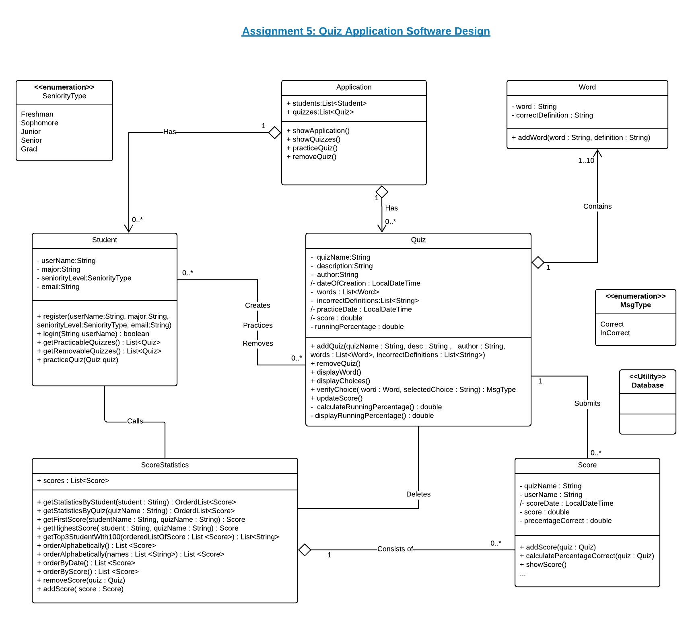
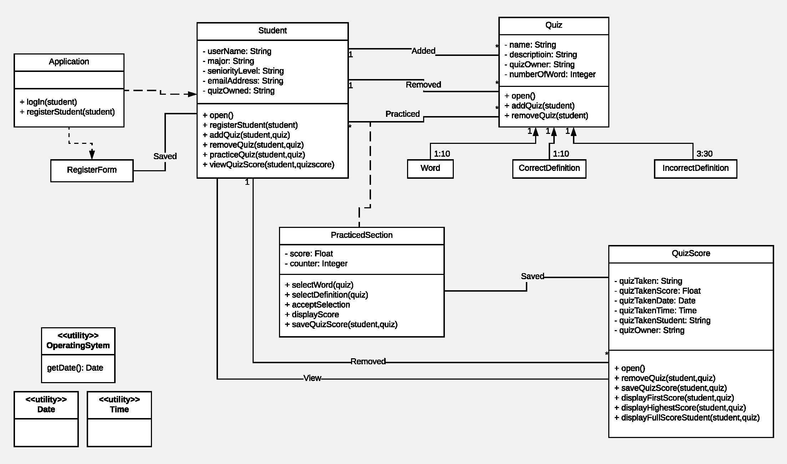
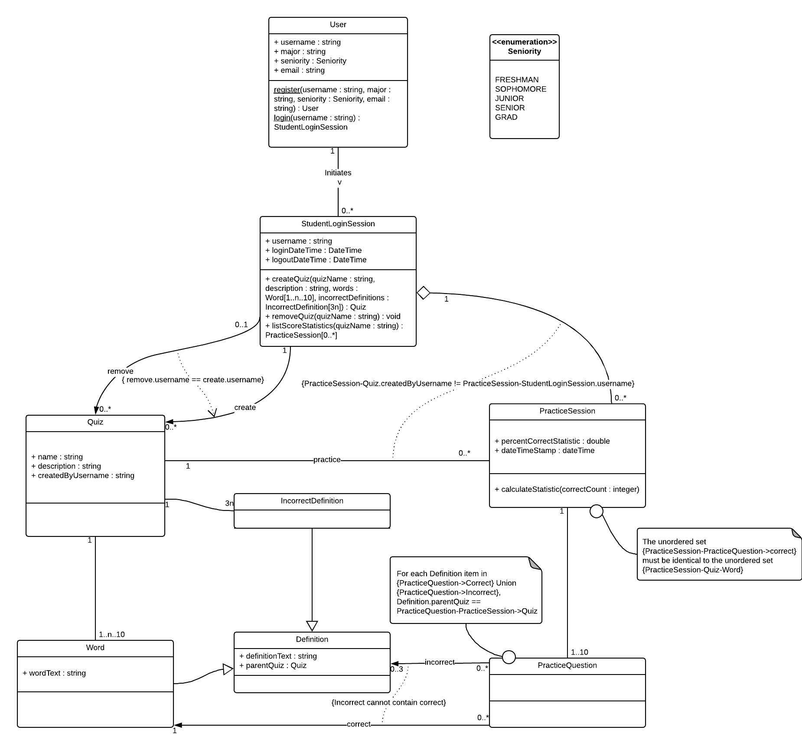
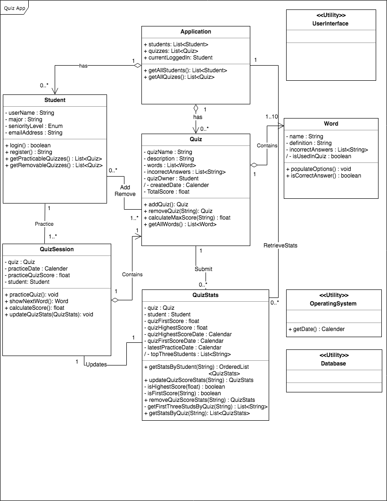
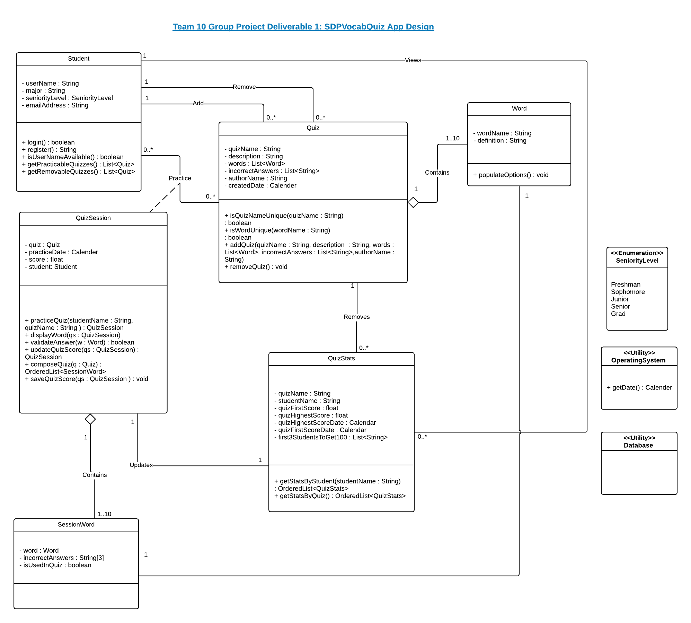

# Team 10 Group Project Deliverable 1: Design-Discussion

## Individual Designs Section:

### Design 1 (bsingh60)

* Pros
    - Very simple, easy to understand.
    - Relationships and Methods are clear.
    - Good naming conventions.
* Cons
    - Greater level of detail than required (orderAlphabetically, orderByDate, orderByScore)
    - Method “calculateRunningPercentage()” in Quiz class is not needed.

### Design 2 (hluo33)

* Pros
    - Very clean and easy to read, flows well.
    - Attributes and methods are named well.
* Cons
    - No need to have CorrectDefinition and IncorrectDefinition classes.
    - RegisterForm class is not needed.
    - Some methods are definitive but too complex..
    - Word class should include attributes of “wordName” and “definition”.

### Design 3 (nturnbow3)

* Pros
    - Captures some tricky relationships.
    - Separates conceptual objects from rendering (view-model) objects (ex: separate class for a "Word" and a "PracticeQuestion")
* Cons
    - Uses some unconventional syntax.
    - Relies heavily on constraints.
    - Too many difficult to comprehend note.

### Design 4 (rjethva3)

* Pros
    - Includes `<<utility>>` interfaces.
    - Exposes methods for determining practicable  and removable quizzes for a user.
    - Makes quiz "stats" distinct from quiz sessions (scores).
* Cons
    - Uses undefined data type "enum" for a user's seniority level.
    - Some ambiguous relationship types.

## Team Design Section:

We as a team decided to start with one of the individual designs and incorporate the positive characteristics of the other individual designs. After we assembled a draft, it underwent a rigorous peer review process where each member of the team provided feedback and made further changes to improve the clarity and accuracy of the design and to further refine some of the ideas inspired by the individual designs.

**Commonalities**
* Most of our individual designs had a Student class and a Word class. We consolidated our designs and created a new design which has most of the components from our existing designs. We added some new characteristics to the team design to make it more detail oriented and to ensure that it is easy to understand what needs to be done as part of the app.
* The team design uses ideas from Design 1 and Design 4 to represent the connection between Student, Quiz and QuizStats classes.
* We kept Student,Quiz,Word,QuizStats and QuizSession classes and added a new class named SessionWord to capture each set of word-definitions for display.
* We reviewed and updated class relationships and multiplicity.

**Differences**
* We removed Application Class.
* We added an Operating System utility.
* We added a database utility.

**Design Decisions**

After a thorough analysis of the individual designs, we decided to create an elaborative UML class diagram with the following 6 classes:
* Student Class
    - login() method in Student class enables login process.
    - register() method for registration.
    - IsUserNameAvailable() method will ensure that no two students regsiter with same username, even if they have similar names.
    - getPracticableQuizzes() method will fetch only those quizzes which a student is allowed to practice as per the requirements. This method will NOT return any quizzes created by the student.
    - getRemovableQuizzes() method will fetch only those quizzes which a student is allowed to remove as per the requirements.
* Quiz Class
   - isQuizNameUnique() method will ensure that no two students create a quizzes with same names.
   - isWordUnique() method ensure that a word is unique in a particular quiz.
   - addQuiz() enables creating new quiz in the System.
   - removeQuiz() method will enable quiz removal process. removeQuiz() method will remove the quiz from the system as well as removes the stats from the quiz stats. This method will be called on only those quizzes which is created by the student.
* Word class
   - populateOptions() method takes care of the  options populated for quiz words.
* SessionWord class
   - SessionWord class is a new addition in the class diagram. It holds a particular word and its definitions in a particular quiz and also keeps track whether or not a particular word has already been displayed.
* QuizSession Class
   - practiceQuiz() method facilitates practicing a quiz operation.
   - displayWord() method will display a particular word and its correct definition and the 3 randomly picked incorrect definitions as per the requirements details. This method will also use the correct definitions of other words in the given quiz as incorrect options for this word.
   - validateAnswer() will validate the user's selected answer.
   - updateQuizScore() will facilitate the quiz score handling at the end of each quiz session.
   - composeQuiz() method composes quiz for each quiz session.
   - saveQuizScore() saves and submits quiz score to QuizStats.
* QuizStats Class
   - getStatsByStudent() method facilitates scores for each student's quiz attempts.
   - getStatsByQuiz() fetched scores for each quiz.

* We decided to use both Lists and database to store all data related to quizzes, students, and scores.
* We originally had an Application class with Lists of Students and Quizzes. We removed that after team discussion.
* We decided to add arrows to our relationship descriptions to show the direction of the relationship between two classes.
* We have identifiers for all the methods and attributes in any particular class.
* During our design discussion, we talked through basic implementation for each method.

## Summary
* Team 10 worked well together for this assignment. The discussion was productive, and we all agreed that a simple, yet extensible design would be most adequate at this stage of the project. We all became aware how each team member can differ in their views of the assignment, their interpretation of the requirements, and their vision of the initial design. In the end, our teamwork allowed us to push forward and achieve our goal of a simple and extensible design we were looking for.
* One key takeaway from reviewing our Assignment 5 designs was that although all of us looked at the same requirements, our designs were similar yet different. Our unique interpretations led to differences in our UML diagrams.
* We also realized that it is much easier to understand another person's diagram with a verbal explanation.
* Our team had 1 meeting to review our Assignment 5 designs and then further 2 meetings to create our new team design. Team members were present and engaged during each meeting.
* We used Blue Jeans and Google hangouts for our team meetings and to discuss ideas and also created a whatsapp group for quick short conversations and updates outside of meeting times.
* We discussed a skeleton code based on the team-design to plan for the implementation part of the project.
