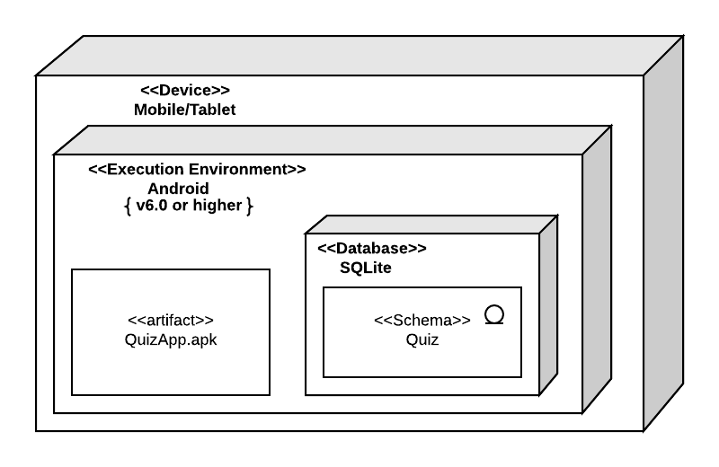
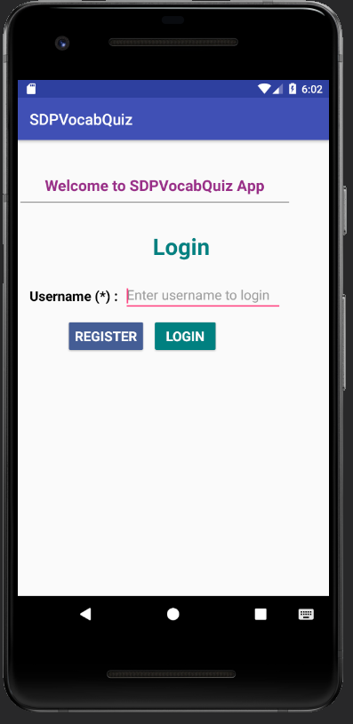
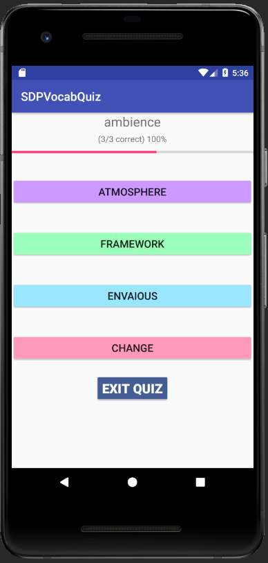
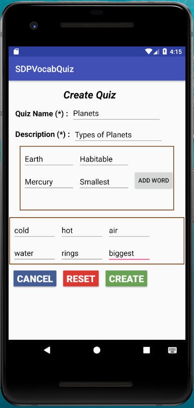
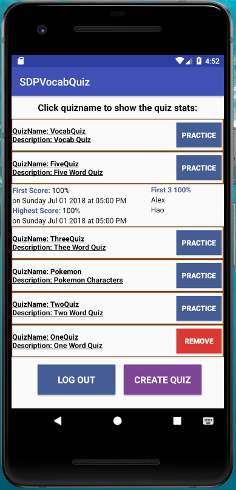

# Design Document

### Version History

<table class="tg" style="border: solid 1px;border-collapse:collapse;">
  <tr>
    <th style="border: solid 1px">Version</th>
    <th style="border: solid 1px">Description</th>
    <th style="border: solid 1px">Details</th>
  </tr>  <tr>       <td style="border: solid 1px">1.0</td>      <td style="border: solid 1px">Design Document for alpha version</td>      <td style="border: solid 1px">Initial design document</td>  </tr>  <tr>
       <td style="border: solid 1px">2.0</td>
      <td style="border: solid 1px">Final Design document</td>
      <td style="border: solid 1px">         <ul>             <li>Added few more assumptions </li><li>Updated use case diagram to add log out feature</li><li>Updated project issues and enhancements</li><li>Updated screenshots and related descriptions</li>        </ul></td>
  </tr></table>

**Author**: Team 10
* Bharati Singh, bsingh60
* Hao Luo, hluo33
* Nathan Turnbow, nturnbow3
* Rajan Jethva, rjethva3

## 1 Design Considerations

Below sub sections will describe detailed design for Quiz application which includes assumptions, constraints, System environment, Architectural UML diagrams and UI Screenshots

### 1.1 Assumptions

Below are assumptions, software dependencies, its use, the operational environment, or significant project issues related to Quiz app.

**Assumptions**

* This app will support only English words and will not support any other languages
* Student’s partial attempt score will not be persisted and will not be displayed in stats. Student has to start the quiz from start when s/he  choose to practice again
* Once removed quiz and it’s stats will not be rolled back by any means.
* Users will never be deleted from the system.
* One user will be able to create multiple usernames.
* User will easily impersonate another user if s/he knows other user’s username
* User will not see other user’s stats except top 3 student details who got 100 for the given quiz
* User will be able to input only `A-Z`, `a-z`, `0-9`, `-` and ` ` characters while creating quiz

**Software dependencies**

* User must have Android Studio installed to build the APK from the github repository.
* User must have Java and Gradle installed to build the app.
* User must have github repository access to download the app source code.

**Use**
* App will be distributed to individual device via university Github and they need to build and install app to their device manually.
* Every student has to close the application after finishing their work to allow other students to login.
* User must use username created by self.

**Operational environment**

* Student has to manually build and copy the APK file to the android device to install the quiz app. Once installed, other student can use same device to create, practice or delete quiz and view their stats.
* Quiz will be stored on local device so it will be not be available on any other devices.
* Quiz Score will not be distributed and will only available local to device.

**Project issues or future enhancements**

* Student log out is must have feature and will be available now in final version of the app.
* Search Student and Search Quiz are nice to have features and will be included in next version of the app.
* Centralized score management is must have feature and will be available in next major release of the app.
* Open bugs, issues and enhancements are listed [here](!https://github.gatech.edu/gt-omscs-se-2018fall/6300Fall18Team10/issues)
* Any future enhancements must be listed here [here](!https://github.gatech.edu/gt-omscs-se-2018fall/6300Fall18Team10/issues))

### 1.2 Constraints

* This App will run only on Tablet or Mobile device. It will not be run on other android devices like smart watch or CarPlay.
Android device having app has to be shared between multiple students to effectively use quiz application.
* Since app will run on local device, we need not to handle multiple threads handling or asynchronous processes. In addition to this, no need to manage multiple users processing and no need to design related to distributed environment.
* iOS users will not be able to use this app which will omit huge set of users in market
* Once app is uninstalled from the device all app data will be removed and will not be restored on reinstall.
* There will not be any installer or uninstaller for this app. User has to manually clean up app folder from the device to uninstall app.

### 1.3 System Environment

* Minimum Android OS version to run this app is 6.0.
* Minimum hardware requirement for this app is 100 MB RAM, 1 GB of persistent storage.
* Android device must be touch enabled.
* Android app will be installed on the internal storage of the mobile device and cannot be moved to the external storage.
* Mobile with screen size of 5' or more is recommended

## 2 Architectural Design

Quiz application architecture is described by Component Diagram, Deployment Diagram, Class Diagram and Sequence Diagram.

### 2.1 Component Diagram

Quiz application will have 2 main Component. Application itself and SQLite database. Application component will contain Authentication Logic which will be responsible for login and register functionality of the app. Quiz Logic will be responsible for creating and removing quiz. Quiz Session Manager logic will be responsible for practice quiz function of the app. Quiz activity will frequently interact with Quiz Session Manager component to create new quiz session for student. Quiz Stats logic activity will be used to support view statistics functionality.

### 2.2 Deployment Diagram

Quiz app will be deployed to local android tablet or mobile device. As shown in below diagram, mobile hardware must have installed android version 6 or higher. Android OS will provide execution environment to run the quiz app. OS will provide required drivers and classes to support various application features. Quiz application will be built by running gradle script on Android Studio IDE which will generate `QuizApp.apk`. This apk will be copied to Android device via USB cable. Quiz app will use SQLite database to store the app related data. Quiz schema will contain multiple table required to support app.

## 3 Low-Level Design

### 3.1 Class Diagram

The class diagram has the following classes:

1. Student
2. Quiz
3. Word
4. QuizSession
5. QuizStats

Following is the list of the Utility classes:

1. Opearating System
2. QuizDBHelper
3. CreateQuizDBUtility

### 3.2 Other Diagrams

Below is the sequence diagram which shows the dynamic behavior of the application.

Sequence diagram depicts of 5 major use cases and related behavior in the diagram.

* Register Users - First section of the diagram shows how a student can register to the app.
* Login - Second section shows interaction between the user and system for login function.
* Create Quiz - First loop of the diagram shows how a student can create a quiz.
* Practice Quiz - Second loop of the diagram shows how a student can practice a quiz.
* View stats - fifth section of the diagram shows dynamic behavior of the app while viewing quiz statistics.
* Remove Quiz - final section of diagram shows interaction between actor and system to remove quiz
* Log out - Student or author of the quiz can log out of the system by using Log out feature

## 4 User Interface Design

1) Home Screen - When user will click on quiz app icon on android device, s/he will see below screen. User can login to the application using existing user name by providing user name in text box and clicking `LOGIN` button. User will see login error message on this screen if the user name is invalid. User can register or sign up to the application using `REGISTER` button. If the user is not registered he will get an error message saying `Username doesn't exist!` as shown in the screenshot below:

__NOTE__ :
* Space will be trimmed from the user input.
* Username is case sensitive

2) Registration / Sign Up Screen - Using this interface, user can sign up to the application. User has to provide unique user name in first textbox. If user name is not unique, user will see error message in error ballon. User has to enter their major in second textbox. User has to select one of the seniority level from the dropdown. User has to provide their preferred email address in last textbox. All fields on these screens are mandatory to successfully register in the system. Username is case sensitive so user has to enter the exact case while logging in application.

3) Operation Screen - After successful login user will see the operation screen where user can select what operation s/he would like to perform. He can choose to do one of the following operations:

*  Practice Quiz
*  Create Quiz
*  Remove Quiz
*  See Quiz Stats
*  Log out

__NOTES__ :

* User will see `PRACTICE` button for only those quizzes which are not created by him/her
* User will see `REMOVE` button for only those quizzes which are created by the user
* All the quizzes will be listed in the order of when they practiced, most recent first
* Quizzes which are not practiced will be in random order
* `LOG OUT` button will log out the student and display login page
* `CREATE QUIZ` button will display create quiz screen
* To view the stats of the quiz, user can click on quiz name. That will open accordion and user can see first attempt with date, highest score attempt with date and list of first 3 students name who got 100%

4) Practice Quiz Screen - On selecting a specific quiz to practice, user will see quiz session screen where s/he will see one word at a time along with their options. User need to select correct answer by pressing the word option button. User will get immediate feedback about the answer they selected and next word will be displayed. If the word is last word than selecting the option will save its details in database. User also has an option to quit the quiz by clicking `EXIT QUIZ` button. Doing so will not persist the score in database. User will be redirected to Operations Screen after successfully finishing the quiz or terminating the incomplete quiz. If user wants to log out of the system, user has to exit out of the quiz and go to operations screen from where s/he can log out.

5) Create Quiz - When user will select `CREATE QUIZ` option on operations screen, user will get below screen where s/he can enter list of words, 3 x words time incorrect answers, unique quiz name, its short description and other details. User will get validation error message on ballon next to the field if quiz name is not valid or word is not unique to the quiz. User need to click `CREATE` button to save quiz. `RESET` button will reset all the fields and user can start fresh. `CANCEL` button will display operations screen where user can practice, add or remove other quizzes.

__NOTES__ :
* All fields are mandatory on this screen.
* Definitions and incorrect options has to be unique in entire quiz.
* If user clicks `ADD WORD` button, user has to add the word and its definition. There is no way to remove newly added textbox
* In case if `CREATE` button doesn't create quiz, there is a high chance of validation failure of one or more fields. It is recommended to scroll through the list of words and list of options to find out errors. Errors will be highlighted using ballon next to the field.
* User can only input `A-Z`, `a-z`, `0-9`, `-` and ` ` characters

6) Display Quiz Stats - When user will select a quiz name or quiz description to display statistics, s/he will be able to see the detailed quiz score. User can see quiz name, first score, first score date, highest score, highest score date and table containing first 3 student's name who got 100 in alphabetical order.

