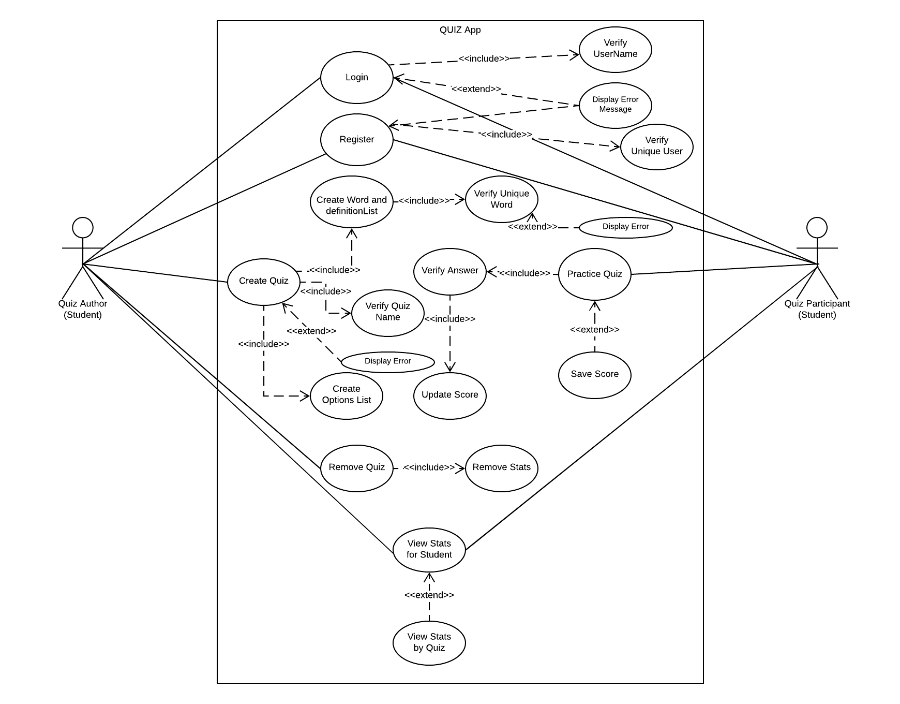

# Use Case Model

**Author**: Team 10
* Bharati Singh, bsingh60
* Hao Luo, hluo33
* Nathan Turnbow, nturnbow3
* Rajan Jethva, rjethva3

## 1 Use Case Diagram

## 2 Use Case Descriptions

1. Login.
    - Requirements: Application user must be able to login the system.
    - Pre-conditions: The student account exists in the system.
    - Post-conditions: The student successfully logs in to the system and is able to perform other functionalities.
    - Scenarios:
        * The student inputs correct username to log in to the system.
        * The student inputs incorrect username, and an error message will be thrown.

2. Register.
    - Requirements: Application users must be able to register as a student user.
    - Pre-conditions: The device must have the Quiz app installed, and quiz app must be running. The student username does not exist in the system.
    - Post-conditions: The new student account exists in the system with required information (username, major, seniority level and email address).
    - Scenarios:
        * Application user is a new student.
        * The student has an existing user account, but registers other accounts.
        * The student inputs a username which is already taken and an error message will be thrown.

3. Create Quiz.
    - Requirements: Quiz author must be able to create quizzes in the system.
    - Pre-conditions: Quiz author has an account in the system and successfully logs in to the system, and the quiz name does not exist in the system.
    - Post-conditions: A new quiz has been created in the system with 0 < N < 11 words and their respective correct definitions along with exactly 3 * N incorrect definitions defined.
    - Scenarios:
       * Quiz author wants to create a new quiz.
       * Quiz author fails to create a quiz due to a duplicate quiz name
       * Quiz author fails to create a quiz due to an incorrect number of word definitions
       * Quiz author fails to create a quiz due to an incorrect number of incorrect word definitions

4. Remove Quiz.
    - Requirements: Quiz author must be able to remove quizzes created by him/her from the system. Removing a quiz must result in all associated quiz score stats being removed as well.
    - Pre-conditions: Student is logged in to the system. The quiz exists in the system and is created by the currently logged in student.
    - Post-conditions: The quiz is removed from the system, and all quiz score stats associated with those quizzes (if any) no longer exist in the system. Students should no longer be able to practice the removed quiz.
    - Scenarios:
       * Quiz author wants to remove a quiz that he/she created along with all quiz score stats associated with that quiz (if any).
       * Quiz author fails to remove a quiz created by another user. 

5. Practice Quiz.
    - Requirements: Quiz participant must be able to practice quizzes that are not created by him/her.
    - Pre-conditions: Student must be logged in to the system. The quiz exists in the system and is not created by the currently logged in user.
    - Post-conditions: Student successfully practices the quiz and the score for that quiz is saved in the system.
    - Scenarios:
        * The student wants to practice a quiz created by another student.
        * The student fails to practice a quiz created by him/herself

6. View Quiz Stats.
    - Requirements: Application user must be able to view the list of quiz score statistics for a student for all quizzes, ordered based on when they were last played by the student (most recent first). Clicking on a quiz must display (1) the student’s first score and when it was achieved (date and time), (2) the student’s highest score and when it was achieved (date and time), and (3) the names of the first three students to score 100% on the quiz, ordered alphabetically.
    - Pre-conditions: The student must be logged in the system.
    - Post-conditions: The quiz score stats for that quiz have been shown to the student.
    - Scenarios:
        * The student wants to view the quiz score stats
