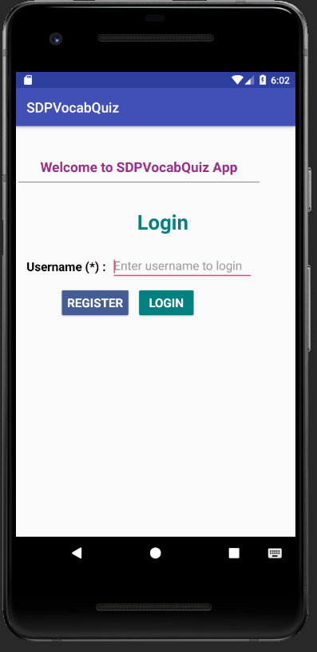
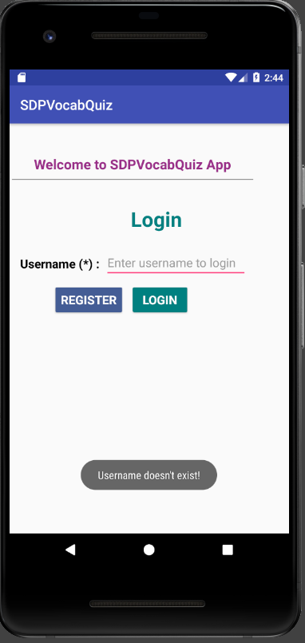
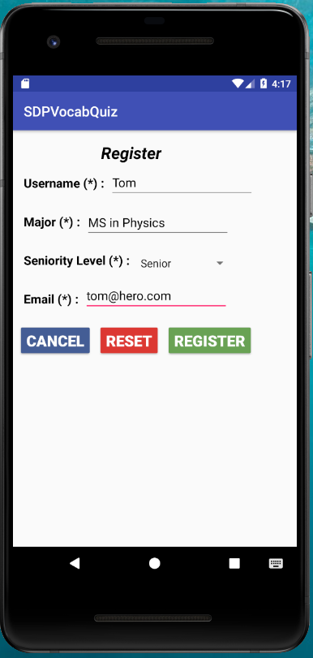
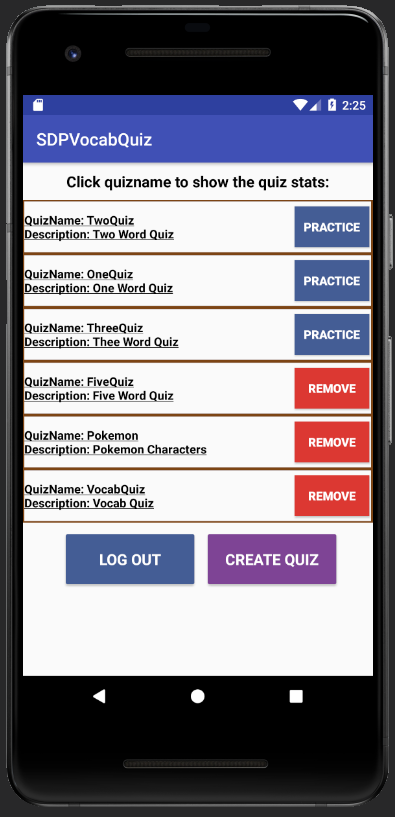
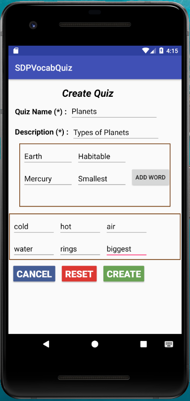
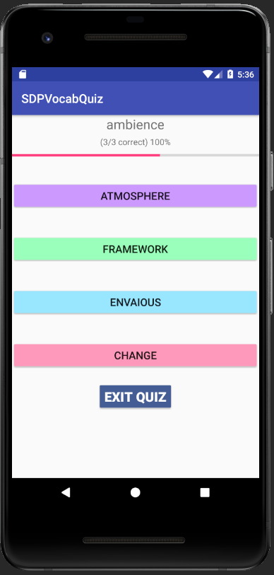
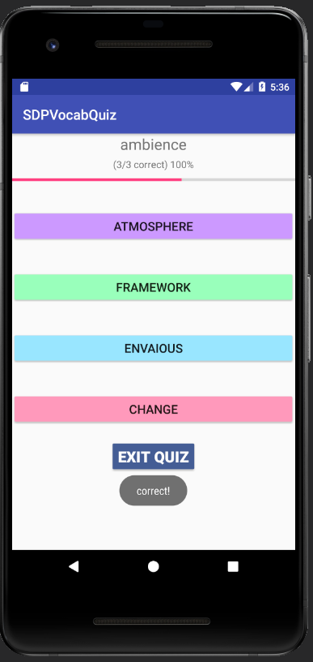
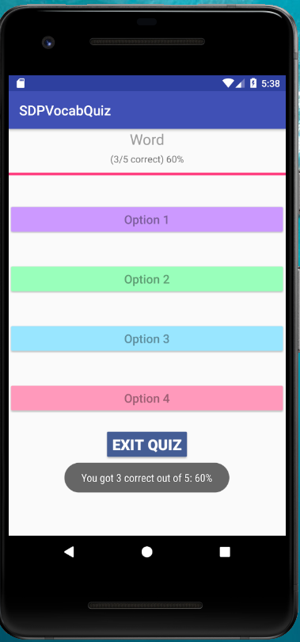
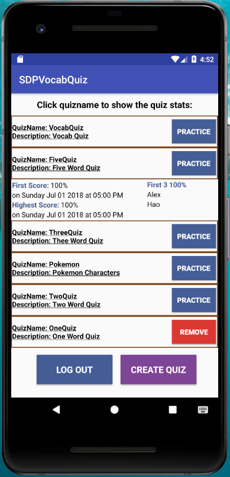

# SDPVocabQuiz app - User Manual

#### Version History

<table class="tg" style="border: solid 1px;border-collapse:collapse;">
  <tr>
    <th style="border: solid 1px">Version</th>
    <th style="border: solid 1px">Description</th>
    <th style="border: solid 1px">Details</th>
  </tr>  <tr>       <td style="border: solid 1px">1.0</td>      <td style="border: solid 1px">Manual for alpha version</td>      <td style="border: solid 1px">Initial draft of manual with screenshots and functionalities from the Alpha version</td>  </tr>  <tr>
       <td style="border: solid 1px">2.0</td>
      <td style="border: solid 1px">Manual for Final version</td>
      <td style="border: solid 1px">         <ul>             <li>Updated the screen shots as per the final version of the app.</li>             <li>Added more details about the functionality.</li>             <li>Added default Test Data</li>        </ul></td>
  </tr></table>

**Author**: Team 10

* Bharati Singh, bsingh60
* Hao Luo, hluo33
* Nathan Turnbow, nturnbow3
* Rajan Jethva, rjethva3

## Description

The SDPVocabQuiz app is a system that runs on the Android platform and is distributed through Github.gatech.edu. APK for this application can be downloaded from [here](!https://github.gatech.edu/gt-omscs-se-2018fall/6300Fall18Team10/tree/master/GroupProject/APK). SDPVocabQuiz is used to help students study vocabulary terms for their classes by practicing quizzes and it also allows students to create quizzes to challenge each other. Currently SDPVocabQuiz is only supported on the Android platform running version 6.0 and higher.

## Instructions

The following section will give an overview of how to install and use SDPVocabQuiz App.

### Installation

SDPVocabQuiz is distributed to individual device via university Github. There are 2 ways to install the app.

1) Install using APK file

Download the SDPVocabQuiz apk file from [this](https://github.gatech.edu/gt-omscs-se-2018fall/6300Fall18Team10/tree/master/GroupProject/APK) location to the Android device. Open APK file to install app. Launch app using SDPVocabQuiz icon.

2) Install using source code -

In the local computer, download the SDPVocabQuiz app by cloning the Github repository ("git clone https://github.gatech.edu/gt-omscs-se-2018fall/6300Fall18Team10.git"). Then in the Android Studio, open the existing project through the local directory: "~/GroupProject/SDPVocabQuiz/". In the local Android tablet, turn on the "Developer options" in "Settings/About tablet". Connect the device to the local computer through a USB cable. In the Android Studio, click the "Run" menu and select the device name to install the SDPVocabQuiz app.

## How to use the SDPVocabQuiz App:

### Login as an existing user

If you are already registered in the system, you can login to the SDPVocabQuiz app by following these steps:
* Enter your username in the `Username` field.
* Click `LOGIN` button. User will be redirected to the Main screen.

__NOTE__ :
* Space will be trimmed from the user input.
* Username is case sensitive
* Existing users : `Bharati`, `Hao`, `Nathan`, `Rajan`, `Q`, `Alex`, `Will`, `Erin`. User can use any one of the above mentioned user name to login to the app

 

If the user is not registered s/he will get an error message saying `Username doesn't exist!` as shown in the screenshot below:

 

### Register as a new user
If you are not already registered , please follow the steps mentioned below to register as a new user:
* Click `REGISTER` button on the Login screen to be directed to the Registration screen.
* Enter a unique `Username` in the `Username` field.
* Enter the `Major` information in the `Major` field.
* Select `Seniority Level` from dropdown list.
* Enter a valid email address in the `Email` field. The email field accepts input in the format of `name@domain.com` only.
* Click `REGISTER` button. The user is immediately created in the system and will be redirected to the login screen.
* User can reset the screen by clicking `RESET` button.
* User can go to login page by clicking `CANCEL` button.

### Create a quiz
To create a quiz, follow the steps below:
* Click the `CREATE QUIZ` button On the Main screen to be redirected to the `Create Quiz` screen.
* Enter a unique quiz name in the `Quiz Name` field.
* Enter a short description in the `Description` field.
* Enter the quiz word in the `Word` field.
* Enter its correct definition in the `Definition` field.
* Enter three incorrect definitions in the `Option` boxes.
* Click `ADD WORD` button.
* Repeat the above 4 steps until all words have been added.(Max words allowed in a Quiz is 10.)
* Click `CREATE` button. The quiz will be immediately created in the system.
* To reset click `RESET` button.
* Click the `CANCEL` button to return to the Main screen.

__NOTES__ :
* All fields are mandatory on this screen.
* Definitions and incorrect options has to be unique in entire quiz.
* If user clicks `ADD WORD` button, user has to add the word and its definition. There is no way to remove newly added textbox
* In case if `CREATE` button doesn't create quiz, there is a high chance of validation failure of one or more fields. It is recommended to scroll through the list of words and list of options to find out errors. Errors will be highlighted using ballon next to the field.
* User can only input `A-Z`, `a-z`, `0-9`, `-` and ` ` characters

### Remove a quiz
To remove a quiz follow the steps below:
* On the Main screen, click the `REMOVE` button next to the Quiz name you wish to remove. This will remove the quiz from the system along with its statistics. You are only allowed to remove the quiz you created.

__NOTES__ :

* User will see `REMOVE` button for only those quizzes which are created by the user
* All the quizzes will be listed in the order of when they practiced, most recent first
* Quizzes which are not practiced will be in random order
* `LOG OUT` button will log out the student and display login page

### Practice a quiz
To practice a quiz follow the steps below:
* On the Main screen, click the `PRACTICE` button next to the quiz you wish to practice. Quiz will start and will display the first word along with 4 answer choices.
* Select a word definition from the given choices.
* After every word, your progress will be displayed as progress bar as shown in the screenshot below.
* Click the `EXIT QUIZ` button to return to the Main screen.
* User will be redirected to main screen after successfully finishing the quiz or terminating the incomplete quiz.
* If user wants to log out of the system, user has to exit out of the quiz and go to operations screen from where s/he can log out.

__NOTE__:
* As part of installer we are providing 5 quizzes created by default students listed in login section. `OneQuiz`, `TwoQuiz`, `ThreeQuiz`, `FiveQuiz`, `VocabQuiz`. Any new students can practice these quizzes.

* All words in the Quiz need to be practiced to get a score saved in the system.

* The success percentage of the quiz will be shown after the practice.

### View the score stats for a quiz
To view the quiz score stats follow the steps below:
* Click the quiz name or quiz description on the Home screen.
* The score stats of that quiz first score along with date and time, highest score along with date and time and three student names who scored 100% for that quiz will be displayed in alphabetical order. If there are no student with 100% score then `[Nobody has scored 100% yet]` message will be displayed

### Log out options
To log out of the system, follow the steps below:
* On the Main screen, click the `LOG OUT` button to return to the LOGIN screen.

## System Requirement

* Minimum Android OS version to run this app is 6.0.
* Minimum hardware requirement for this app is 100 MB RAM, 1 GB of persistent storage.
* Android device must be touch enabled.
* Android app will be installed on the internal storage of the mobile device and cannot be moved to the external storage.
